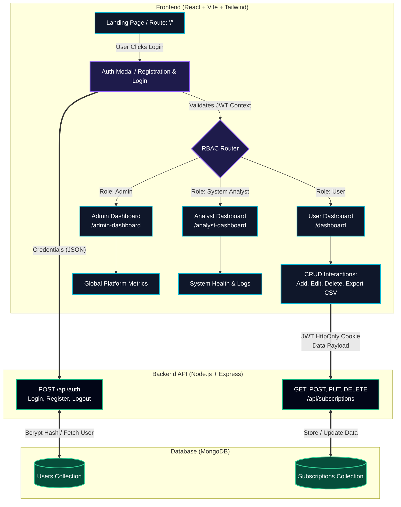

# System Flow Diagram: STArt (Subscription Tracking Application)

This diagram outlines the complete flow of the Progressive Web Application (PWA), capturing authentication, Role-Based Access Control (RBAC) routing, client-side interactions, and backend data processing.

