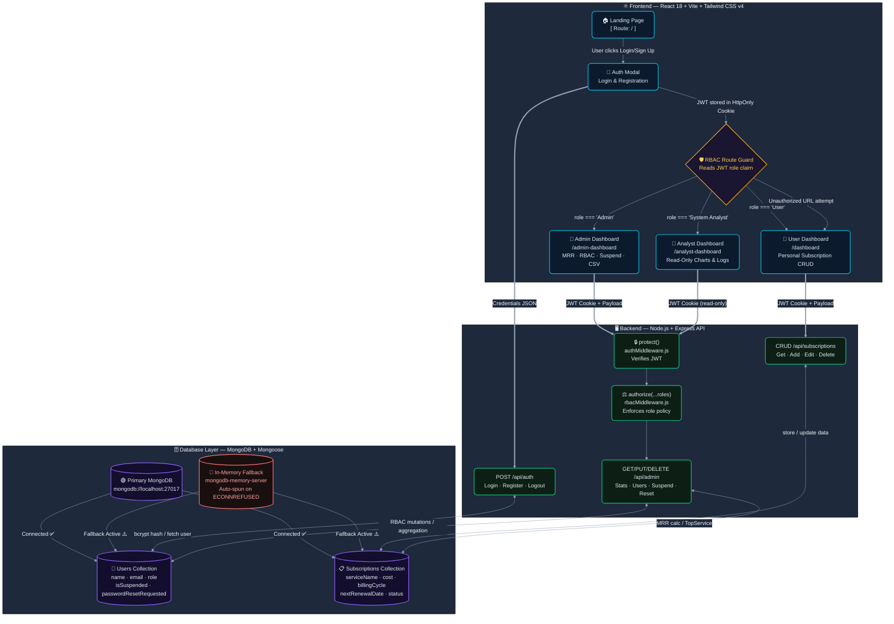
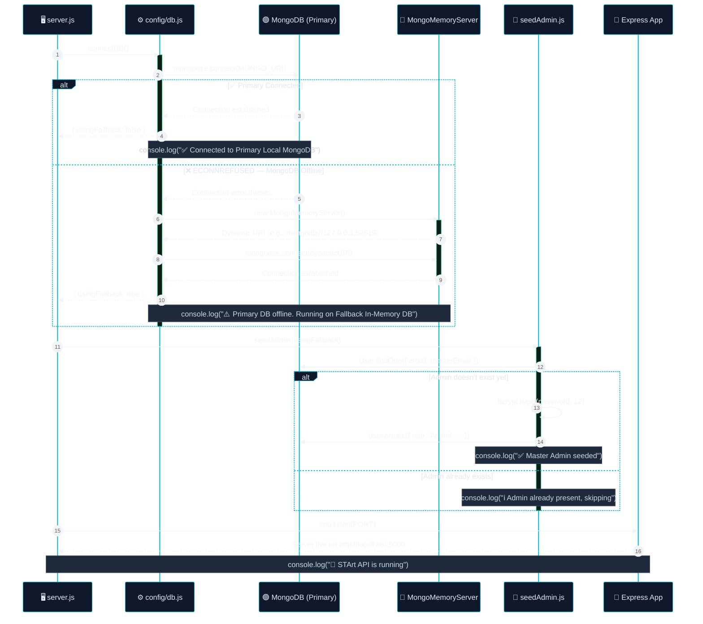
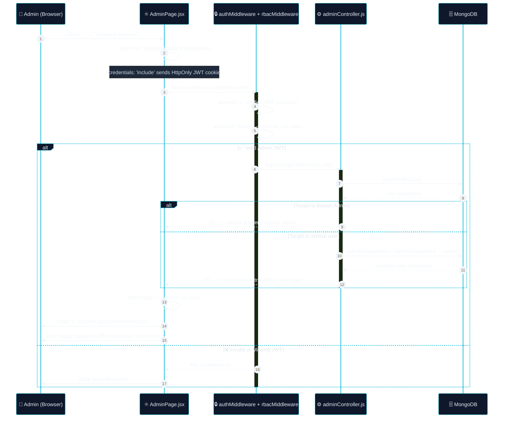
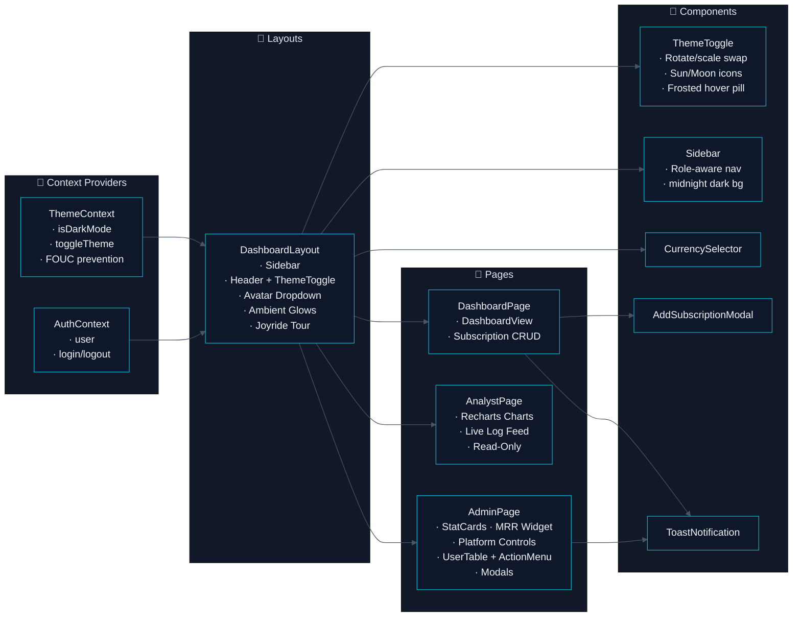

# 🏗️ STArt — System Architecture & Flow Diagrams

> *Visual documentation of the complete request lifecycle, RBAC routing, and database resilience architecture of the STArt Subscription Tracking Application.*

---

## Diagram 1 — Full System Flow (Auth → RBAC → Data Layer)

This diagram traces every user action from the browser to the database and back, including the RBAC role decision tree and the bidirectional data flow through the Express API.

---

## Diagram 2 — Database Resilience: Primary → Fallback Boot Sequence

This sequence diagram shows the exact async startup order implemented in `server.js` and `config/db.js`, including the graceful fallback when MongoDB is unreachable.

---

## Diagram 3 — Admin Action Flow: Suspend / Force-Reset / RBAC Change

This diagram shows the full lifecycle of an admin performing a destructive action from the UI through to the database.

---

## 📐 Component Architecture — Frontend Module Map

---

*Last updated: August 2026 · STArt v1.0 · MCA Program, IITE Indus University*
