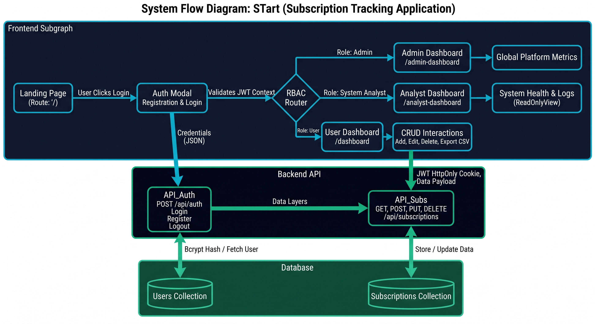

<div align="center">

<br/>

```
  ███████╗████████╗ █████╗ ██████╗ ████████╗
  ██╔════╝╚══██╔══╝██╔══██╗██╔══██╗╚══██╔══╝
  ███████╗   ██║   ███████║██████╔╝   ██║   
  ╚════██║   ██║   ██╔══██║██╔══██╗   ██║   
  ███████║   ██║   ██║  ██║██║  ██║   ██║   
  ╚══════╝   ╚═╝   ╚═╝  ╚═╝╚═╝  ╚═╝   ╚═╝   
```

### **Subscription Tracking Application**

> *"Stop leaking money to forgotten subscriptions. Track every rupee, every renewal, every time."*

<br/>

<p>
  
  
  
  
</p>
<p>
  
  
  
  
  
</p>

<br/>



<br/><br/>

</div>

---

## ⚡ The "Why" — A Real Problem, A Real Solution

In today's subscription economy, the average person pays for **8–12 recurring services** and has forgotten about at least 3 of them. That's money silently draining every single month.

**STArt** was born out of frustration with this exact problem. Built by engineering students who wanted to solve something *real* — not another todo app — it gives you a crystal-clear, unified command center to track every subscription, visualize your spending habits, and cancel services *before* they auto-renew.

> *This isn't just an academic project. It's the app we wished existed.*

---

## ✨ Features — Our Technical Flexes

### 🔐 Enterprise-Grade Security Architecture
- **Multi-Tier RBAC** — Three hardcoded role levels (`User`, `System Analyst`, `Admin`) enforced at both the frontend route-guard layer and the backend `authorize()` middleware on every API endpoint.
- **HttpOnly JWT Cookies** — Authentication tokens are stored in tamper-proof, JavaScript-inaccessible HttpOnly cookies to prevent XSS attacks.
- **Bcrypt Password Hashing** — All passwords are salted and hashed using `bcryptjs` before database persistence. Plain-text passwords never touch the DB.
- **Route Interception** — If a `User` manually types `/admin-dashboard` in the URL bar, the React router intercepts and redirects them instantly. No exceptions.

### 🌗 Premium Dual-Theme Engine
- **Zero-Flash Theme Loading** — The `dark` class is applied to `<html>` *synchronously before React mounts*, eliminating the white flash that plagues most dark-mode implementations.
- **500ms Buttery Transitions** — All theme swaps use `cubic-bezier(0.4, 0, 0.2, 1)` easing — the same physics curve used by Material Design and Google.
- **Premium Light Mode** — Warm `slate-100` off-white main backgrounds instead of harsh pure white. Cards are `bg-white` with `shadow-sm` elevation.
- **Ultra-Deep Dark Mode** — `#0B1120` midnight backgrounds (deeper than `slate-950`) with `white/5` glass-card borders — a hallmark of premium tools like Linear and Vercel.
- **Animated ThemeToggle** — Rotating icon-swap mechanism: the Sun rotates out at `rotate(90deg) scale(0)` while the Moon rotates in from `rotate(-90deg) scale(0)` simultaneously, with a frosted-glass hover pill.

### 👑 Super-Admin Command Center
- **Live Global MRR** — Aggregates all active platform subscriptions (normalizing yearly billing to monthly) to display a real-time Monthly Recurring Revenue figure.
- **Top Tracked Service** — MongoDB `$group → $sort → $limit` aggregation pipeline identifies the single most-tracked service across all users.
- **Account Suspension** — Toggle a red `🔒 Suspended` badge on any user. The `isSuspended` flag persists to the database. Master Admin account is protected from self-suspension.
- **Force Password Reset** — Flags the user's `passwordResetRequested` field and simulates an email trigger (production-ready with a mailer swap).
- **User Data Inspector** — A slide-in modal fetches and renders all subscription records for any specific user.
- **Export Global Audit Log** — One-click CSV export of the full user registry + system health metrics with a timestamp-named file.
- **Maintenance Mode Toggle** — Animated on/off switch with clear status indicators.

### 💾 Resilient Database Architecture
- **Zero-Crash Fallback** — If the local MongoDB instance is offline (e.g., `ECONNREFUSED`), the server seamlessly spins up `mongodb-memory-server` in milliseconds instead of crashing.
- **Clear Console Signaling** — Developers always know which database is active: `✅ Connected to Primary Local MongoDB` or `⚠️ Primary DB offline. Running on Fallback In-Memory DB`.
- **Auto-Seeded Admin** — On first boot, the system automatically seeds the master Admin account using `bcrypt` hashing — no manual database setup required.

### 📊 Interactive Analytics Dashboard
- **Visual Recharts Integration** — Category breakdown (Donut), monthly spend trend (Area Chart), and upcoming renewal timeline (Bar Chart).
- **Currency Conversion Engine** — Real-time subscription cost display in INR, USD, EUR, GBP, and more — switchable from the header.
- **Trial Tracker** — Dedicated hub to manage free trials and flag upcoming auto-conversion dates.

### 📱 Progressive Web App (PWA)
- **Installable** — Add STArt to your home screen on Android or desktop with a single tap. Works like a native app.
- **Service Worker** — Background sync and offline caching for a resilient, app-like experience.

---

## 🛠️ Tech Stack — The Architecture

| Layer | Technology | Purpose |
| :--- | :--- | :--- |
| **Frontend** | React 18 + Vite | Component UI, SPA routing, blazing-fast HMR |
| **Styling** | Tailwind CSS v4 | Utility-first design with `@custom-variant dark` |
| **Charts** | Recharts | Declarative, animated SVG data visualization |
| **Backend** | Node.js + Express | RESTful API server, middleware, routing |
| **Auth** | JWT + bcryptjs | Stateless auth via HttpOnly cookies + hashing |
| **Database** | MongoDB + Mongoose | ODM schemas, aggregation pipelines |
| **DB Fallback** | mongodb-memory-server | In-process RAM database when MongoDB is offline |
| **PWA** | Vite PWA Plugin | Service worker, manifest, offline caching |

---

## ⚙️ Installation — Spin It Up In 4 Steps

### Prerequisites

Make sure you have these installed:
- **Node.js** v18+ — [nodejs.org](https://nodejs.org)
- **MongoDB Community** (for the local database, optional — app will fall back automatically if offline)
- **Git** — [git-scm.com](https://git-scm.com)

---

### Step 1 — Clone the Repository

```bash
git clone https://github.com/ShasankShah01/Subscription-Tracking-Application.git
cd "Subscription Tracking Application"
```

### Step 2 — Install All Dependencies

```bash
# Backend
cd backend
npm install

# Frontend (in a new terminal)
cd ../frontend
npm install
```

### Step 3 — Configure Environment Variables

Create a `.env` file inside `/backend`:

```env
# backend/.env

PORT=5000
MONGO_URI=mongodb://localhost:27017/start-tracker
JWT_SECRET=your_super_secure_jwt_secret_here
NODE_ENV=development
```

> **💡 Pro Tip:** You don't even need MongoDB installed to run this app. If the connection fails, the server automatically starts an in-memory fallback database and seeds the admin account. Just skip the `MONGO_URI` and it still works.

### Step 4 — Ignite the Engines 🔥

```bash
# Terminal 1 — Start the Express API
cd backend
node server.js

# Terminal 2 — Start the React Frontend
cd frontend
npm run dev
```

The app will be live at **`http://localhost:5173`** 🚀

The API will be running at **`http://localhost:5000`**

---

## 🗂️ Project Structure

```
Subscription Tracking Application/
├── backend/
│   ├── config/
│   │   └── db.js                  # Primary → In-Memory DB fallback logic
│   ├── controllers/
│   │   ├── adminController.js     # MRR, TopService, Suspend, ForceReset
│   │   └── subscriptionController.js
│   ├── middleware/
│   │   ├── authMiddleware.js      # JWT protect() guard
│   │   └── rbacMiddleware.js      # authorize(...roles) guard
│   ├── models/
│   │   ├── User.js                # isSuspended, passwordResetRequested fields
│   │   └── Subscription.js
│   ├── routes/
│   │   └── adminRoutes.js         # 7 admin endpoints, role-scoped
│   ├── scripts/
│   │   └── seedAdmin.js           # Auto-seeds master + dev fallback admin
│   └── server.js                  # Async IIFE boot: DB → Seed → Listen
│
├── frontend/
│   └── src/
│       ├── components/
│       │   └── ThemeToggle.jsx    # Rotate/scale icon-swap toggle
│       ├── context/
│       │   └── ThemeContext.jsx   # Pre-React FOUC prevention
│       ├── layouts/
│       │   └── DashboardLayout.jsx
│       └── pages/
│           ├── AdminPage.jsx      # Full SaaS Admin with action dropdowns
│           └── AnalystPage.jsx    # Read-only Recharts analytics
│
└── Docs/
    ├── HOW_TO_TEST_ROLES.md      # Evaluator testing guide
    └── System_Flow_Diagram.md    # Mermaid architecture diagrams
```

---

## 🔒 Role-Based Access Control — Quick Reference

| Role | Dashboard | Can Manage Users | Destructive Actions | Read Analytics |
| :--- | :--- | :---: | :---: | :---: |
| 👤 **User** | `/dashboard` | ✗ | Own data only | Own data only |
| 🔬 **System Analyst** | `/analyst-dashboard` | ✗ | ✗ | ✅ Platform-wide |
| 👑 **Admin** | `/admin-dashboard` | ✅ | ✅ | ✅ Platform-wide |

> See **[`Docs/HOW_TO_TEST_ROLES.md`](./Docs/HOW_TO_TEST_ROLES.md)** for a step-by-step guide to testing all three roles — written specifically for evaluators.

---

## 👨‍💻 Meet the Team

| Developer | Role |
| :--- | :--- |
| **🚀 Shasank Shah** | **Lead Architect & Full-Stack Engineer** — Designed the MERN architecture, engineered the multi-tier RBAC security model, built the SaaS Admin dashboard, and crafted the dual-theme Premium UI system. |
| *(Team Member)* | *Frontend Developer* — Add your contributions here! |
| *(Team Member)* | *UI/UX & QA* — Add your contributions here! |

<br/>

<div align="center">

---

*Built with ❤️, fueled by ambition, and powered by way too much caffeine.*

*MCA Program · IITE, Indus University · 2025–26*

</div>
